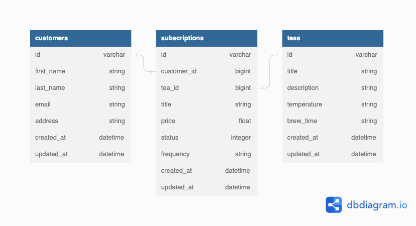

<center>

# Tea Subscription API
</center>

### Table of Contents
- [About the Project](#about-the-project)
- [Architecture](#architecture)
- [Database](#database)
- [Built With](#built-with)
- [Gems](#gems)
- [Setup / install](#setup--install)
- [Endpoints](#endpoints)
- [Further development possibilities](#further-development-possibilities)
- [Developer info](#developer-info)

# About the Project
  This project was given without much direction on purpose. We are to create a Rails API for a Tea Subscription Service. In order to meet MVP we need to create an endpoint for a customer to create a tea subscription. The customer would also need to be able to cancel an active subscription and see all of the subscription (active or cancelled). We were left to decide how to accomplish building these 3 endpoints for a theoretical FE team to consume.

  - #### _Interpretation_
    - The eagle eye view of how I saw this coming together was to hopefully create an app that dynamically can create a subscription for any tea.
    - This creates a relationship of a customer having many subscriptions as well as a tea having many subscriptions while the subscription belongs to the customer and to the tea.
    - Another way of looking at it is that the subscription table is almost like the joins table between each tea and customer. See below for diagrams.

#### [Back to table of contents](#table-of-contents)
## Architecture
  - This is a Backend application built with a Service Oriented Structure to be consumed by a Frontend team. Rather than create a monolith application, the intent is to serve up endpoints for the front end team to consume.

## Database


#### [Back to table of contents](#table-of-contents)
## Built With
This project used `Ruby 2.7.4`

- with Rails `5.2.x`
- and used `PostgreSQL`


#### [Back to table of contents](#table-of-contents)
## Gems


#### [Back to table of contents](#table-of-contents)
## Setup / Install
- Fork this repository
- Clone your fork
- From the command line, install gems and set up your DB:
  - Run `bundle install`
  - Run `rails db:{create,migrate,seed}`
- Run the test suite with `bundle exec rspec`.
- In your terminal
  - Run `rails s`
  - Navigate endpoints as suggested in the [endpoints](#endpoints) section below
#### [Back to table of contents](#table-of-contents)
---
## Endpoints
  - ## Happy Path
    - [Get all subscriptions for a Customer](#get-all-subscriptions-for-a-customer)
    - [Create a subscription for a Customer](#create-a-subscription-for-a-customer)
    - [Update a subscription for a Customer](#update-a-subscription-for-a-customer)
    - [Get all customers](#get-all-customers)
    - [Get all teas]()
    ## Get all subscriptions for a Customer
    - GET `/api/v1/users/1/subscriptions`
    - example response
    ```
    {
      "data": [
        {
          "id": "10",
          "type": "subscription",
          "attributes": {
            "title": "Gold",
            "price": 8.69,
            "status": "active",
            "frequency": "weekly",
            "customer_id": 2,
            "tea_id": 19
          }
        },
        {
          "id": "14",
          "type": "subscription",
          "attributes": {
            "title": "Silver",
            "price": 2.35,
            "status": "active",
            "frequency": "weekly",
            "customer_id": 2,
            "tea_id": 13
          }
        }
      ]
    }
    ```
    ## Create a subscription for a Customer
    - POST `/api/v1/users/1/subscriptions`
    - example params (all below fields required) :
    ```
    params: {
      title: "Introduction Pack",
      price: 13.99,
      tea_id: 4,
      frequency: "monthly"
    }
    ```
    - example response
    ```
    {
      "data": {
        "id": "31",
        "type": "subscription",
        "attributes": {
          "title": "'Intro pack'",
          "price": 13.99,
          "status": "active",
          "frequency": "monthly",
          "customer_id": 1,
          "tea_id": 4
        }
      }
    }
    ```
    ## Update a subscription for a Customer
    - PATCH `/api/v1/users/1/subscriptions`
    - _You can change the current status to either active or cancelled in relation to its status before updating the subscription_
    - example params:
    ```
    params: { status : 'cancelled' }
    ```
    - example response
    ```
    {
      "data": {
        "id": "1",
        "type": "subscription",
        "attributes": {
          "title": "Silver",
          "price": 14.36,
          "status": "cancelled",
          "frequency": "monthly",
          "customer_id": 5,
          "tea_id": 19
        }
      }
    }
    ```
    #### [Back to table of contents](#table-of-contents)
    ## Get all customers
    - GET `/api/v1/customers`
    ```
    {
      "data": [
        {
          "id": "1",
          "type": "customer",
          "attributes": {
            "first_name": "Ashley",
            "last_name": "Kassulke",
            "email": "freeman@example.org",
            "address": "2091 Man Common, Gulgowskifurt, VA 96852-1765"
          }
        },
        {
          "id": "2",
          "type": "customer",
          "attributes": {
            "first_name": "Scarlet",
            "last_name": "Walker",
            "email": "danae.huel@example.org",
            "address": "Apt. 663 88917 Danyel Mission, Halvorsonstad, OH 22246"
          }
        },
      etc...
      ]
    }
    ```

    #### [Back to table of contents](#table-of-contents)

    ## Get all teas
    - GET `api/v1/teas`
    ```
    {
      "data": [
        {
          "id": "1",
          "type": "tea",
          "attributes": {
            "title": "Gunpowder",
            "description": "Well, this is great. If the ionization-rate is constant for...",
            "temperature": "The things I do for love.",
            "brew_time": "balanced"
          }
        },
        {
          "id": "2",
          "type": "tea",
          "attributes": {
            "title": "Darjeeling",
            "description": "It's true, your honor. The man is some kind...",
            "temperature": "Laughter is poison to fear.",
            "brew_time": "lingering"
          }
        },
      etc...
      ]
    }
    ```

---
## Further Development possibilities
- Given more time
  - subscription to be preset with many teas
  - implement customer authentication
  - implement customer authorization levels
  - reach out to a 3rd party API to bring in real tea data
  - The price would be better fit on individual teas to then aggregate the price on to the subscription
  - Further edgecase and sad path testing

## Developer Info

- [GitHub](https://github.com/RyanChrisSmith)
- [LinkedIn](https://www.linkedin.com/in/ryanchrissmith1/)
#### [Back to table of contents](#table-of-contents)
